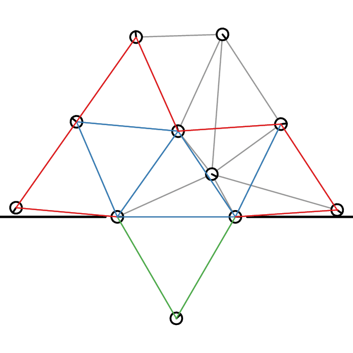

# Structured-Triangulation-in-Multi-Robot-Systems

This Git publishes the results of the [Project Thesis](https://www.tu-braunschweig.de/informatik-msc/struktur/wpinf/projekt) _Structured-Triangulation-in-Multi-Robot-Systems_.

## Abstract

Simple robots are not able to map their environment due to missing sensors or limited computational capabilities. This strongly limits their capabilities, e.g. in exploration as it cannot remember if it has visited a place before. With a swarm of such simple robots, many problems efficiently can be solved by cooperation. This thesis considers robots only knowing the distances to neighbors as well as sensing collisions. These robots build an infrastructure by triangulating their environment (using robots as nodes and communication links as edges) to support other robots. This thesis builds upon and extends work of Lee et al. that implemented this for robots with bearing sensors. Further, we consider the removal of robots from this triangulation such that the created areas are of limited size. This creates a street network with a specific density that can be reached quickly from any point. We show that it is NP-hard to remove a maximum amount of robots such that the size constraints are still fulfilled and give a practical heuristic. The methods in this thesis have been implemented and tested in a simulator with simulation experiments provided at the end of the corresponding chapters.

[Full thesis](./Thesis.pdf)

## Animation

The following animation shows a rectangular area being triangulated by a swarm of robots.
Of this triangulation, clusters of limited radius are removed such that a street network remains.
Below you can find videos of the two processes.

## Videos

The following video shows the triangulation process.

The following video shows the partition process.

## Code

The code is written for the [Platypus3000 Simulator](https://github.com/SwarmRoboticResearch/platypus3000).
